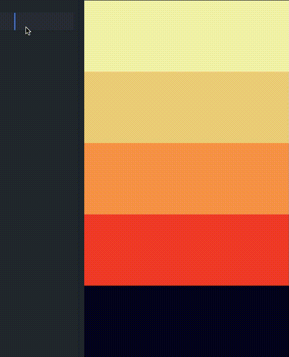

# Point & Paste
Point & Paste is a simple macOS tool that makes the research for the right color easier: **Just point your cursor to a color you like and copy its hex code to your clipboard.**

# Requisites

1. XCode
2. Automator

# Installation

1. Clone this repository

2. Open the src folder with XCode & Build it

3. Execute the build_workflow shell script `chmod +x build_workflow && . build_workflow`

4. Bind whatever key you like to the **pp** service

# Open issues
Since this project is very new there are a list of issues that are not fixed yet:
1. Sometimes, if the mouse gets moved, it will be copied the hex color of adjacent pixels

2. It requires the permission to record your screen from the applications subject to the pixel capture (a pop-up request will be shown). Unfortunately if the permission is not given, the application will result transparent and the only color that will be captured is the one of the background

3. It can be hard to find a key-binding not used by all the applications. One that

**Please feel free to contact me if you find any other issue or a solution to the above problems: I appreciate every pull request.**

# TO-DO list

1. Add brew installation

2. Fix the above issues
